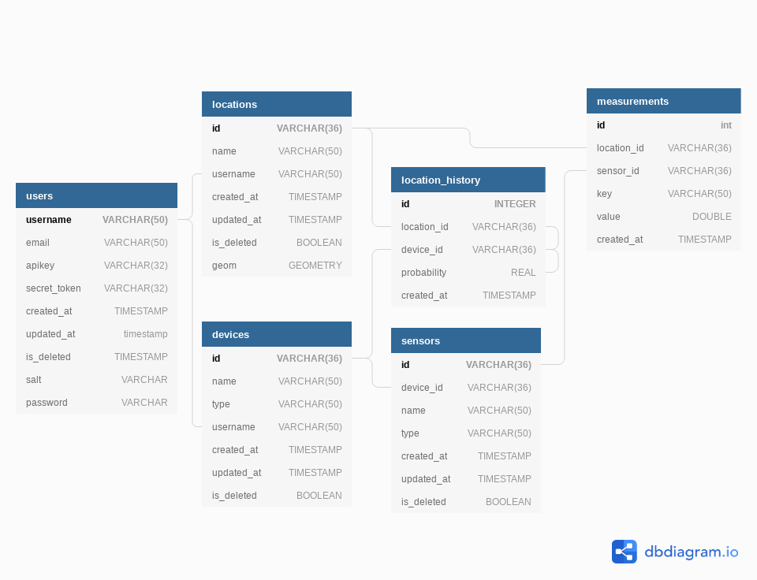

# FIND 5
F.I.N.D. Version 5

## Database

### Setup
The `bootstrapper.sh` script will automatically create a PostGreSQL database and user for the FIND system. The database connection parameters can also be set via command line arguments:

| argument | default    | description       |
| -------- | ---------- | ----------------- |
| dbhost   | localhost  | database host     |
| dbport   | 5432       | database port     |
| dbname   | finddb     | database name     |
| dbuser   | finduser   | database username |
| dbpass   | dev        | database password |

### System Objects
There are several types objects with in the FIND system: `Users`, `Devices`, `Locations`, `Sensors`, and `Measurements`. Each of these objects share relationship(s) with other object types. The relationship structure is as follows:

